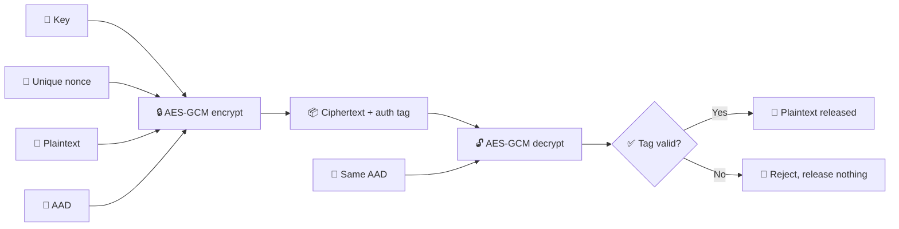
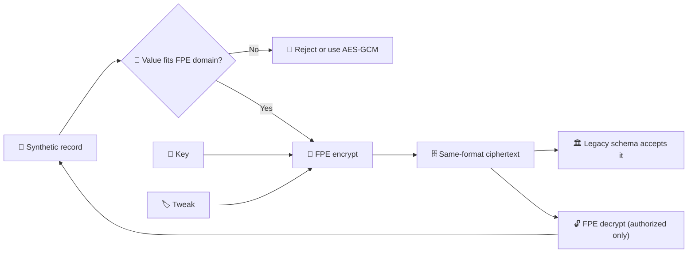
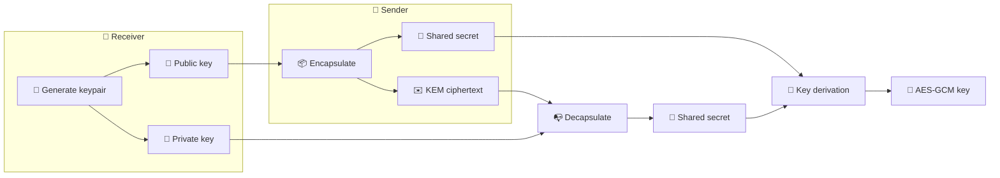
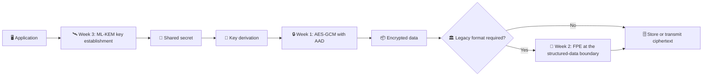

# 🔐 Cryptography And Data Protection Weekly Projects

A progressive series of three independent Python security-engineering projects. Each project stands alone, but together they form a learning path from modern symmetric encryption, through data-format constraints, to post-quantum key establishment.

> ⚠️ **Educational use only.** All bundled records are synthetic. See [Security Notes](#-security-notes) before adapting any code for production.

---

## 📑 Table of Contents

- [Overview](#-overview)
- [Requirements](#-requirements)
- [Installation](#-installation)
- [Project Details](#-project-details)
  - [Week 1: AES-GCM Authenticated Encryption](#-week-1-aes-gcm-authenticated-encryption)
  - [Week 2: Format-Preserving Encryption for Synthetic PII](#-week-2-format-preserving-encryption-for-synthetic-pii)
  - [Week 3: Post-Quantum Key Encapsulation (ML-KEM / Kyber)](#-week-3-post-quantum-key-encapsulation-ml-kem--kyber)
- [Running Demos and Tests](#-running-demos-and-tests)
- [Learning Roadmap](#-learning-roadmap)
- [Security Notes](#-security-notes)
- [Overall Flowchart](#-overall-flowchart)

---

## 🗺️ Overview

| Week | Project | Topic | Category |
|------|---------|-------|----------|
| 1 🔒 | `WEEK1_AES_GCM` | AES-GCM authenticated encryption with associated data (AEAD) | Symmetric cryptography |
| 2 🧩 | `WEEK2_FPE_PII_PROTECTION` | Format-preserving encryption for synthetic structured data | Data protection / legacy compatibility |
| 3 🛰️ | `WEEK3_POST_QUANTUM_KYBER` | CRYSTALS-Kyber, standardized by NIST as ML-KEM (FIPS 203) | Post-quantum cryptography |

## 📋 Requirements

- 🐍 Python 3.11 or later
- 📦 `pip` and the standard `venv` module

## ⚙️ Installation

**🪟 Windows (PowerShell)**

```powershell
python -m venv .venv
.\.venv\Scripts\Activate.ps1
pip install -r requirements.txt
```

**🍎🐧 macOS / Linux**

```bash
python -m venv .venv
source .venv/bin/activate
pip install -r requirements.txt
```

---

## 📚 Project Details

### 🔒 Week 1: AES-GCM Authenticated Encryption

**🏷️ Category:** Symmetric cryptography, AEAD

**🎯 Focus areas**

- 🛡️ Confidentiality and integrity in a single primitive
- 🔢 Nonce uniqueness and the consequences of nonce reuse
- 🔗 Associated data (AAD) for binding ciphertext to its context
- 🚫 Correct handling of authentication failures

**📁 Folder:** `WEEK1_AES_GCM`

**🔄 Flowchart**



### 🧩 Week 2: Format-Preserving Encryption for Synthetic PII

**🏷️ Category:** Structured data protection, legacy schema compatibility

**🎯 Focus areas**

- 🏛️ Why some legacy schemas require ciphertext that keeps the original format
- 📏 Domain-size and input-format limitations
- 📜 Compliance considerations and where FPE does not satisfy them
- ⚖️ Positioning FPE as a narrow tool, not a replacement for AES-GCM

**📁 Folder:** `WEEK2_FPE_PII_PROTECTION`

> 📝 **Note:** The Week 2 dependency is documented as an educational adapter and is not a production recommendation.

**🔄 Flowchart**



### 🛰️ Week 3: Post-Quantum Key Encapsulation (ML-KEM / Kyber)

**🏷️ Category:** Post-quantum cryptography, key establishment

**🎯 Focus areas**

- 🔁 Key encapsulation mechanism (KEM) workflows
- 🛰️ Post-quantum key establishment using a maintained ML-KEM implementation
- 🧬 Deriving symmetric keys from a shared secret
- 🔗 Connecting the KEM output to the AES-GCM work from Week 1

**📁 Folder:** `WEEK3_POST_QUANTUM_KYBER`

**🔄 Flowchart**



---

## ▶️ Running Demos and Tests

Run each project from its own folder:

```powershell
cd WEEK1_AES_GCM
python examples/basic_demo.py
python -m pytest

cd ..\WEEK2_FPE_PII_PROTECTION
python examples/basic_demo.py
python -m pytest

cd ..\WEEK3_POST_QUANTUM_KYBER
python examples/basic_demo.py
python -m pytest
```

To run the complete test suite, execute the following from the repository root:

```powershell
python -m pytest
```

---

## 🧭 Learning Roadmap

The projects build on one another conceptually:

1. 🔒 **Week 1** establishes confidentiality, integrity, nonce uniqueness, AAD, and authentication failure handling.
2. 🧩 **Week 2** shows why legacy schemas sometimes need format-preserving protection, along with its domain and compliance limitations.
3. 🛰️ **Week 3** introduces KEM workflows and post-quantum key establishment using a maintained ML-KEM implementation.

---

## 🛡️ Security Notes

- 🧪 **Synthetic data only.** All bundled records are synthetic demo data. Never commit keys, private key material, real payment data, or personal data.
- ⚖️ **FPE is not a substitute for AES-GCM.** Use it only where format compatibility is a genuine requirement.
- 🎓 **Educational dependency (Week 2).** The Week 2 library is an educational adapter, not a production recommendation.
- 🏭 **Production readiness.** Real systems additionally require:
  - 🪪 Identity binding
  - 🔄 Key lifecycle management
  - 🔁 Replay protection
  - 📝 Secure logging
  - 🚪 Access control
  - 🔍 Dependency review
  - 📡 Operational monitoring

---

## 🌐 Overall Flowchart

How the three projects fit together in one end-to-end design:


