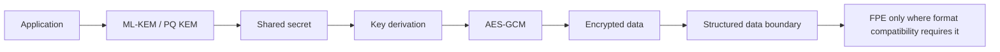

# Cryptography Weekly Projects

Three progressive, independent Python 3.11+ security-engineering projects:

- Week 1 -> AES-GCM authenticated encryption with associated data
- Week 2 -> Format-preserving encryption for synthetic structured data
- Week 3 -> CRYSTALS-Kyber, standardized by NIST as ML-KEM (FIPS 203)

## Install

```powershell
python -m venv .venv
.\.venv\Scripts\Activate.ps1
pip install -r requirements.txt
```

## Run and test

Run each project from its folder:

```powershell
cd WEEK1_AES_GCM; python examples/basic_demo.py; python -m pytest
cd ..\WEEK2_FPE_PII_PROTECTION; python examples/basic_demo.py; python -m pytest
cd ..\WEEK3_POST_QUANTUM_KYBER; python examples/basic_demo.py; python -m pytest
```

From the repository root, run the complete suite with `python -m pytest`.

## Learning roadmap

Week 1 establishes confidentiality, integrity, nonce uniqueness, AAD, and authentication failure handling. Week 2 shows why legacy schemas sometimes need format-preserving protection, along with domain and compliance limitations. Week 3 introduces KEM workflows and post-quantum key establishment using a maintained ML-KEM implementation.



## Security notes

All bundled records are synthetic demo data. Never commit keys, private material, real payment data, or personal data. FPE is not a replacement for AES-GCM and the Week 2 dependency is explicitly documented as an educational adapter rather than a production recommendation. Production systems also need identity binding, key lifecycle management, replay protection, secure logging, access control, dependency review, and operational monitoring.
