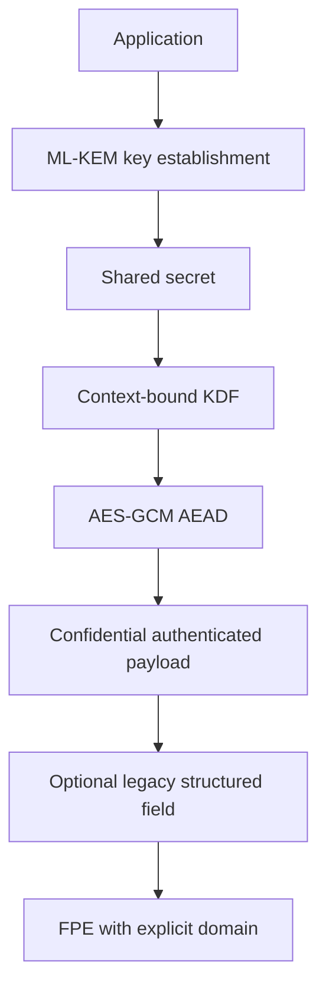

# Integrated security architecture

The three weeks solve different problems:

1. ML-KEM establishes shared key material between parties in a post-quantum-aware design.
2. A KDF turns shared material into keys with protocol-specific context.
3. AES-GCM encrypts application payloads and authenticates metadata and ciphertext.
4. FPE is reserved for narrow structured-data boundaries where a legacy field must retain its domain and length.

FPE must not replace AEAD for general messages: it preserves format but does not inherently provide the same authenticated envelope, and it exposes length and repeated-value relationships. A production hybrid protocol must bind identities, algorithms, transcripts, and key confirmation; this repository demonstrates primitives and boundaries, not a deployable protocol.
